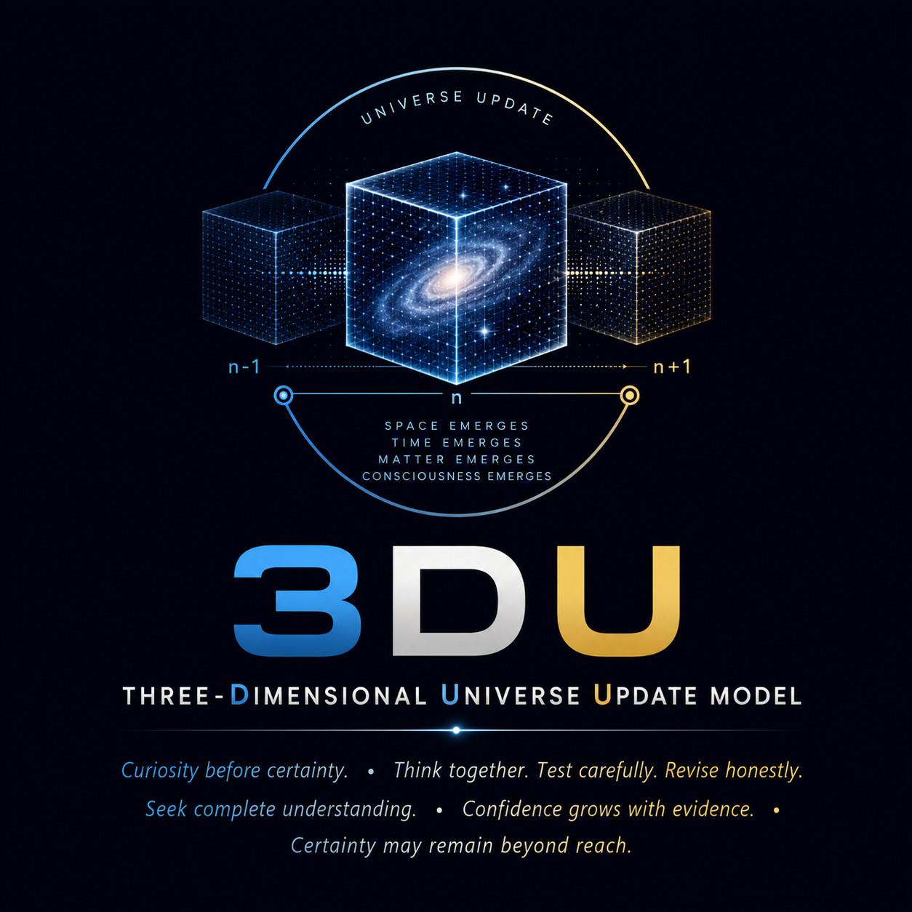

<p align="center">
  
</p>

# Project 3DU
**Three-Dimensional Universe Update Model**

*A collaborative research notebook exploring the possibility that the universe may be understood as a sequence of discrete three-dimensional state updates.*

---

## Project Status

Project 3DU is an early-stage research notebook exploring a speculative model of the universe called the **Three-Dimensional Universe Update (3DU) Model**.

This repository is **not** a finished scientific theory. It is a living research project that documents ideas, questions, comparisons with existing physics, and possible experimental directions.

Readers are encouraged to challenge assumptions, suggest improvements, and help identify both strengths and weaknesses of the model.

---

## Purpose

The goal of this project is to:

- Organize and document the development of the 3DU idea.
- Compare the model with established physics.
- Explore possible mathematical descriptions.
- Identify experimentally testable predictions.
- Welcome constructive discussion and collaboration.

---

## Repository Structure

```text
docs/
discussions/
README.md
DISCLAIMER.md
LICENSE
```

See the `docs/` folder for the technical discussions and the `discussions/` folder for community participation.

---

## Project Origin

Project 3DU began as a series of conversations between an engineer exploring fundamental questions about the universe and an AI collaborator helping organize, challenge, and document those ideas.

The project aims to preserve not only conclusions, but also the evolution of the thinking process.

---

## Philosophy

> Curiosity begins the journey.  
> Evidence guides the path.  
> Humility keeps us moving.  
> 100% certainty remains our ultimate goal, while we celebrate every step that brings us closer.

---

## Current Version

**Foundation Edition v0.1**
